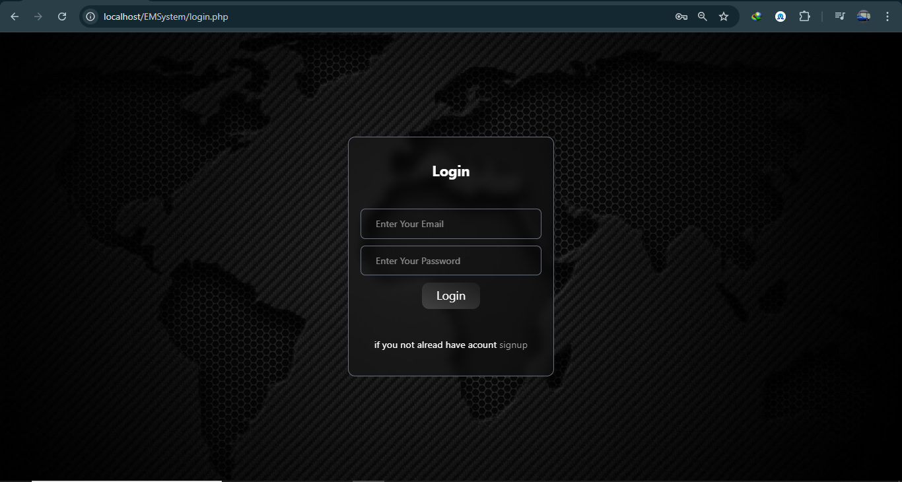
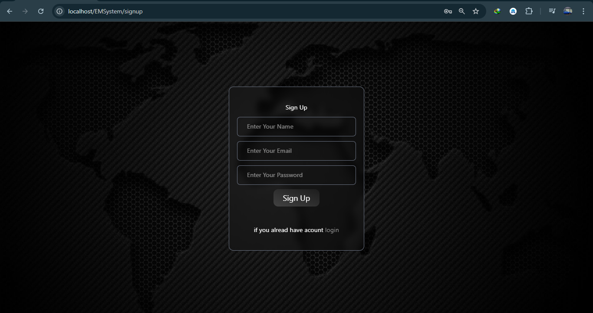
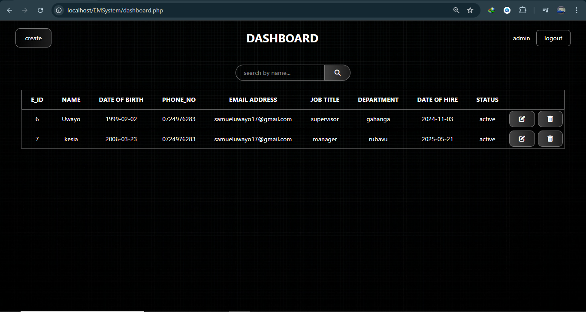
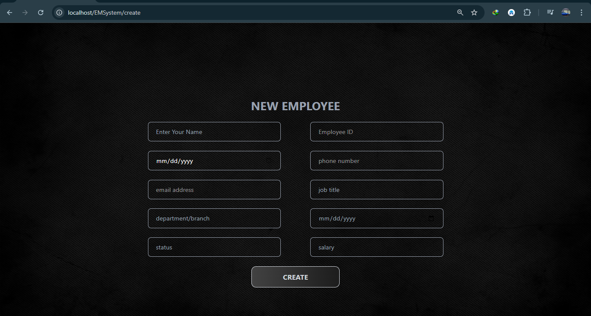
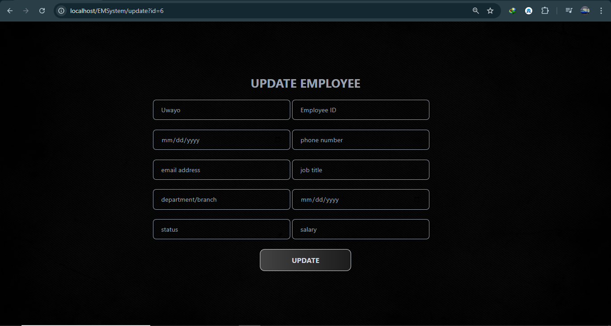

# EMSystem Docs

---

# Employee Management System Documentation

## Introduction

This is a simple website to manage employee information. It allows administrators to view, add, and update employee details.

## How to Use the System

### 1. Login Page

- If you already have an account:
  
  - Enter your email address
  - Enter your password
  - Click "Login" button

- If you don't have an account:
  
  - Click "signup" link at the bottom

### 2. Sign Up Page

- To create a new account:
  - Enter your full name
  - Enter your email address
  - Create a password
  - Click "Sign Up" button
- If you already have an account, click "login" at the bottom

### 3. Dashboard (Main Page)

After logging in, you'll see:

- A search bar to find employees by name
- "Admin" and "Logout" buttons at the top
- A list of all employees with their details:
  - Employee ID
  - Name
  - Date of Birth
  - Phone Number
  - Email Address
  - Job Title
  - Department
  - Date of Hire
  - Status (active/inactive)

### 4. Adding a New Employee

Click the option to add a new employee and fill in:

- Employee name
- Date of birth (in mm/dd/yyyy format)
- Phone number
- Email address
- Job title
- Department/branch
- Date of hire (in mm/dd/yyyy format)
- Status (active/inactive)
- Salary
  Then click "CREATE" button

### 5. Updating Employee Information

When you want to update an employee's details:

- The system will show current information
- You can change any field:
  - Name
  - Date of birth
  - Phone number
  - Email address
  - Job title
  - Department
  - Hire date
  - Status
  - Salary
- Click "UPDATE" button to save changes

## Important Notes

- Only authorized users (admins) can access this system
- Make sure to log out when you're done
- Keep employee information private and secure

This system helps you easily manage all your employee records in one place.
